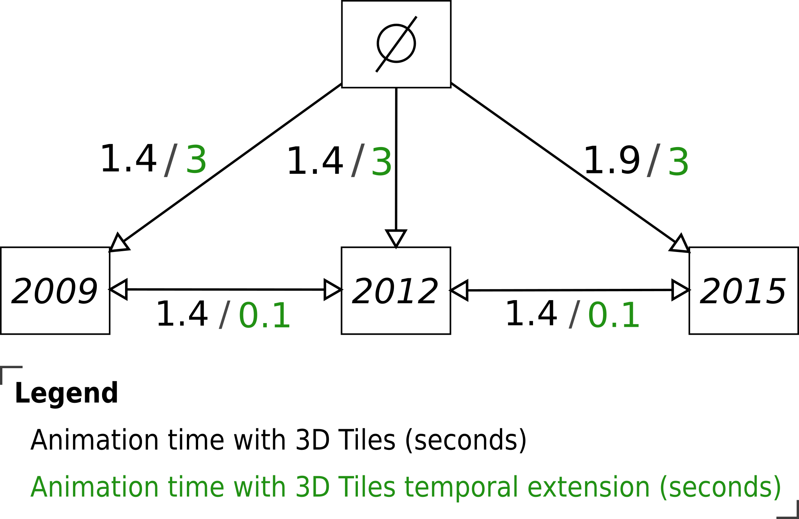
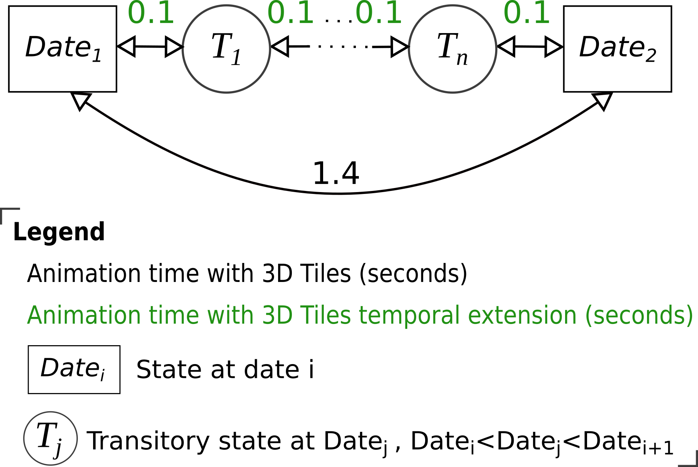

## Animation time (i.e. temporal navigation) comparison

### The results

The following figures compare the animation time for temporal navigation in
DS-3DTiles and DS-3DTiles-Tmp:

<figure>
  
  <figcaption>Figure 1 - Animation time comparison of DS-3DTiles (3D Tiles) and
  DS-3DTiles-Tmp (3D tiles with temporal extension).</figcaption>
</figure>

  

<figure>
  
  <figcaption>Figure 2 - Temporal navigation comparison between 3D Tiles and 3D Tiles with temporal extension.</figcaption>
</figure>

  

**Succinct description of the figures (more details can be found in the paper):**

Figure 1 presents a comparison of the animation time when navigating between timestamps with DS-3DTiles (3D Tiles) and DS-3DTiles-Tmp (3D Tiles temporal extension). Each box represents a state at a given date indicated inside the box. The arrows express a change of state. The mean loading and rendering time (seconds) are respectively in black for DS-3DTiles and in green for DS-3DTiles-Tmp (indicated as xx seconds / xx seconds).

Figure 2 presents the navigation time between two timestamps.

### Reproduce these results

* The animation time with 3D Tiles is deduced from [this result](LoadingAndRendering.md).
* The animation time with 3D Tiles temporal extension can be obtained with [this demonstration](../../../Demos/Temporal-LyonMetropole/Readme.md)
