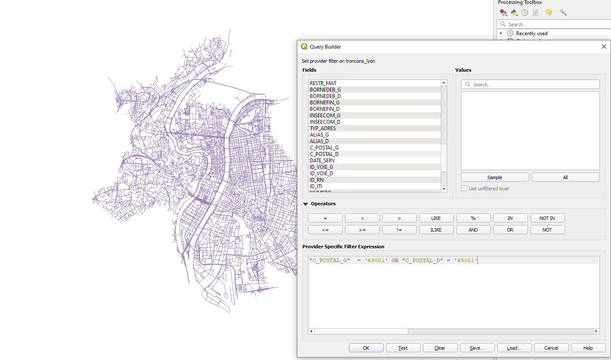

# Compute Lyon 3DTiles

This document explains how to create 3DTiles models of buildings, relief, roads and water bodies from Lyon's open data with [py3dtilers](https://github.com/VCityTeam/py3dtilers).

To be able to use the Tilers from py3dtilers, follow the [installation notes](https://github.com/VCityTeam/py3dtilers#installation-from-sources).

## Geojson Tiler

### __Roads__

Download the [BD Topo](https://geoservices.ign.fr/ressource/161992) data from [IGN](https://geoservices.ign.fr/telechargement)

In [QGIS](https://www.qgis.org/en/site/), open the _BDTOPO/1_DONNEES_LIVRAISON/TRANSPORT/__TRONCON_DE_ROUTE.shp___ file.

You can filter roads, for example by keeping those starting or ending in Lyon 1er:



Then, save the roads layer as a GeoJson file:


To create roads 3DTiles with the [GeoJsonTiler](https://github.com/VCityTeam/py3dtilers/tree/master/py3dtilers/GeojsonTiler), run:

```bash
geojson-tiler --path path/to/troncons_lyon1er.geojson --height 0.5
```

The height argument set how thick are your roads (in meters). You can set it to an arbitrary value.  
You can also set the width of your roads with `--width <float>`. By default, the GeoJsonTiler targets the property `LARGEUR` in geojson features to find the width; the property to target can be changed with `--width OTHER_PROP_NAME`.

See the [GeojsonTiler README](https://github.com/VCityTeam/py3dtilers/blob/master/py3dtilers/GeojsonTiler/README.md) for more information on usage.

### __Water bodies__

Download the [BD Topo](https://geoservices.ign.fr/ressource/161992) data from [IGN](https://geoservices.ign.fr/telechargement)

In [QGIS](https://www.qgis.org/en/site/), open the _BDTOPO/1_DONNEES_LIVRAISON/HYDROGRAPHIE/__SURFACE_HYDROGRAPHIQUE.shp___ file.

You can select only the parts you need:


Then, save the roads layer as a GeoJson file:


To create 3DTiles with the [GeoJsonTiler](https://github.com/VCityTeam/py3dtilers/tree/master/py3dtilers/GeojsonTiler), run:

```bash
geojson-tiler --path path/to/surface_hydro.geojson --height 0.5
```

The height argument set how thick are your water bodies (in meters). You can set it to an arbitrary value.

See the [GeojsonTiler README](https://github.com/VCityTeam/py3dtilers/blob/master/py3dtilers/GeojsonTiler/README.md) for more information on usage.

## CityGML Tiler

Creating 3DTiles with the [CityGML Tiler](https://github.com/VCityTeam/py3dtilers/tree/master/py3dtilers/CityTiler) require [Postgres/PostGIS](https://www.enterprisedb.com/downloads/postgres-postgresql-downloads) and [3DCityDB](https://www.3dcitydb.org/3dcitydb/downloads/). The cityGML data must be hosted in a 3DCityDB database to be used by the CityGML Tiler.  
To host cityGML in database, you can follow [__this tutorial__](https://github.com/VCityTeam/UD-SV/blob/master/ImplementationKnowHow/PostgreSQL_for_cityGML.md) (recommended) or use the [docker](https://github.com/VCityTeam/UD-SV/blob/master/Install/Install3DCityDB.md#1a-installing-a-3dcitydbpostgis-server-the-docker-deployment-case) (may be outdated).

Copy the [configuration file](https://github.com/VCityTeam/py3dtilers/blob/master/py3dtilers/CityTiler/CityTilerDBConfigReference.yml) and add the details of your database.

### __Buildings__

Download the cityGML data from [Data Grand Lyon](https://data.grandlyon.com/jeux-de-donnees/maquettes-3d-texturees-2018-communes-metropole-lyon/info) (you can choose which districts of Lyon you want to download). Then, import the buildings into a 3DCityDB database:


To use the Tiler, see the [CityTiler usage](https://github.com/VCityTeam/py3dtilers/blob/master/py3dtilers/CityTiler/README.md)

To create [LOA](https://github.com/VCityTeam/py3dtilers/blob/master/py3dtilers/CityTiler/README.md#loa), you can for example use _BDTOPO/1_DONNEES_LIVRAISON/ADMINISTRATIF/__ARRONDISSEMENT.shp___ from [BD Topo](https://geoservices.ign.fr/ressource/161992) ([IGN](https://geoservices.ign.fr/telechargement)). To be able to use it, export the .shp as GeoJson with QGIS (the projection must be the same as buildings, i.e EPSG:3946 most of the time for Lyon's data).

To create the 3DTiles with levels of detail, run:

```bash
citygml-tiler <path_to_file>/Config.yml --lod1 --loa polygons.geojson
```

### __Relief__

Download the cityGML data from [Data Grand Lyon](https://data.grandlyon.com/jeux-de-donnees/maquettes-3d-texturees-2018-communes-metropole-lyon/info) (you can choose which districts of Lyon you want to download). Then, import the relief into a 3DCityDB database:


To use the Tiler, see the [CityTiler usage](https://github.com/VCityTeam/py3dtilers/blob/master/py3dtilers/CityTiler/README.md)

To create the relief as 3DTiles, run:

```bash
citygml-tiler <path_to_file>/Config.yml relief
```
