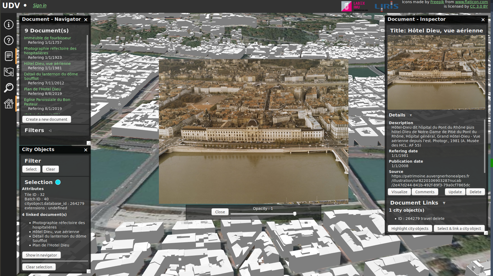

## Set up a demo for linking multimedia documents and 3D urban objects



This demo allows to:

* Visualize the numerical representation of the cities of Lyon, Bron and Villeurbanne in 3D.
* Navigate in the 3D urban objects of this cities
* Navigate in multimedia documents
* Link multimedia documents and 3D urban objects.

This demo is [accessible online](http://rict.liris.cnrs.fr/UDVDemo/UDV/UDV-Core/examples/DemoStable/Demo.html).

### Install

*Note that these install notes currently does not allow automatically integrate multimedia documents. However, it may be done in the future. Multimedia documents can be added following [this tutorial](https://github.com/VCityTeam/UD-Viz/blob/master/doc/UserDoc/ContributeData.md). For the impatient, refer to the accessible online demo referenced above.*

#### 3D city data server

* [Download the data set](https://doi.org/10.5281/zenodo.3606733) representing the 3D cities in 3D Tiles. Detailed notes on how to compute this dataset can also be found [here](../../Computations/ComputeLyonVilleurbanneBron2015/Readme.md).

* Unzip this dataset

* Install a 3DTiles web server: depending on your context proceed with one of
the following install guides:
  * [3dtiles web server: DESKTOP developing context](../../ExternalComponents/3DTilesSamples/Install3dTilesNodeBasedWebServer.md)
   * [3dtiles web server: OPERATIONS (stable server) context](../../ExternalComponents/ApacheServer/InstallDebianApacheServer.md)

#### Multimedia documents and links server

* Install the API_Enhanced_City of  [UD-Serv](https://github.com/VCityTeam/UD-Serv): `https://github.com/VCityTeam/UD-Serv.git`

* Follow these install notes: https://github.com/VCityTeam/UD-Serv/blob/c89553bf9098246f59ec68df2b12501f698aff77/API_Enhanced_City/INSTALL.md

#### Web Client

* Move the unzipped dataset you downloaded previously to `3d-tiles-samples/tilesets/` and test that it is accessible by openning the following URL: http://localhost:8003/tilesets/TileSet_LyonFull_Villeurbanne_Bron_2015/tileset.json

* Intall the UD-Viz web client:

````
git clone https://github.com/VCityTeam/UD-Viz.git
git checkout 0522aafd908dfa17de783adc3e409d6130bee236
cd UD-Viz-Core
npm install
````

* Replace the URL of the 3D data set from the configuration file of UD-Viz ([this line](https://github.com/VCityTeam/UD-Viz/blob/0522aafd908dfa17de783adc3e409d6130bee236/UD-Viz-Core/examples/data/config/generalDemoConfig.json#L71)) with the URL to your tileset, which should be: http://localhost:8003/tilesets/TileSet_LyonFull_Villeurbanne_Bron_2015/tileset.json

* Replace the URL of the Enhanced city web server from the configuration file of UD-Viz ([this line](https://github.com/VCityTeam/UD-Viz/blob/0522aafd908dfa17de783adc3e409d6130bee236/UD-Viz-Core/examples/data/config/generalDemoConfig.json#L5)) by the url to your local web server, which should be: http://localhost/1525/

* Run UD-Viz: `npm start`

* The demo should be accessible at the following URL: http://localhost:8080/examples/DemoStable/Demo.html.

You can now proceed with adding documents, links and navigating in them by following [this tutorial](https://github.com/VCityTeam/UD-Viz/blob/master/doc/UserDoc/ContributeData.md).
