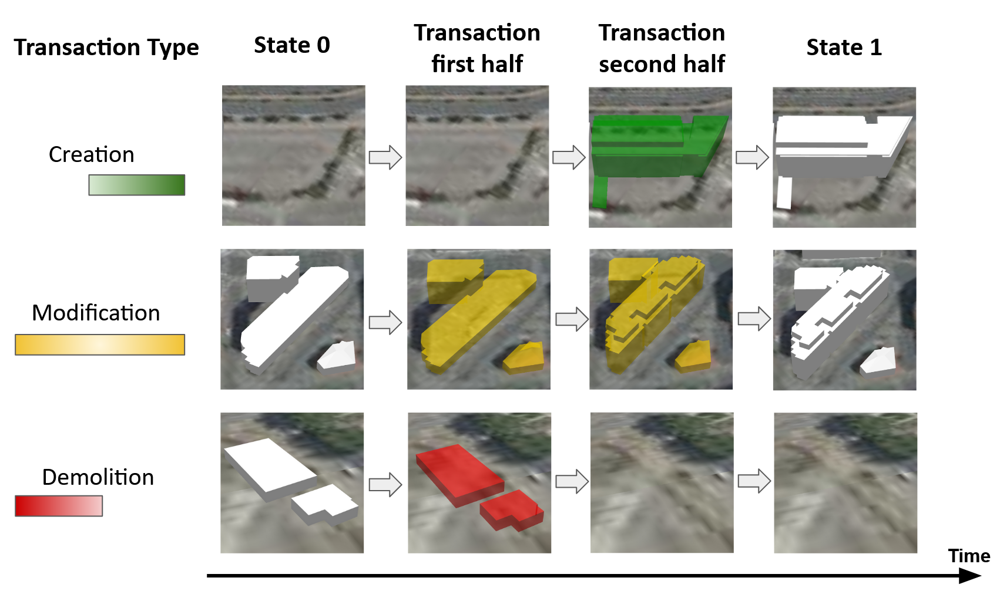

# Visualize a 3D Tiles temporal tileset of the city of Lyon from 2009 to 2015


The goal of this demo is to set up a visualization of a 3D Tiles temporal dataset
representing the evolution of the city from 2009 to 2015. The temporal extension
of 3D Tiles has not been integrated to 3D Tiles yet. The technical specification
in the form of JSON schemas is however
[available online](https://doi.org/10.5281/zenodo.3596881).

## Install

* Download the dataset, [registered and available here](https://doi.org/10.5281/zenodo.3596861),
  that is to be visualized. Detailed notes on how to compute this dataset can also be found
  [here](../../Computations/3DTiles/LyonTemporal/PythonCallingDocker/Readme.md).

* Unzip this dataset

* Install a 3DTiles web server: depending on your context proceed with one of
the following install guides:
  * [3dtiles web server: DESKTOP developing context](../../ExternalComponents/3DTilesSamples/Install3dTilesNodeBasedWebServer.md)
   * [3dtiles web server: OPERATIONS (stable server) context](../../ExternalComponents/ApacheServer/InstallDebianApacheServer.md)

* Move the unzipped dataset you downloaded previously to
`3d-tiles-samples/tilesets/` and test that it is accessible by openning
the following URL:
`http://localhost:8003/tilesets/Lyon_2009-2015_Without_Remarkable_32_Tiles/tileset.json`

* Intall the UD-Viz web client:

````
git clone https://github.com/jailln/UDV.git
git checkout UDV-temporal
cd UDV-Core
./install.sh
````

* Replace the URL of the configuration file of UD-Viz
([this line](https://github.com/jailln/UDV/blob/UDV-temporal/UDV-Core/examples/data/config/generalDemoConfig.json#L20)) with the URL to your tileset, which should be: `http://localhost:8003/tilesets/Lyon_2009-2015_Without_Remarkable_32_Tiles/tileset.json`

* Run UD-Viz: `npm start`

The demo should be accessible at the following URL: http://localhost:8080/examples/DemoTemporal/Demo.html.

## Usage

You can find the available modules of the demo in the sidebar situated on the
left side of the web page. Among these modules, the `Temporal Navigation` module
allows to navigate in time. Clicking on it opens a time slider at the bottom of
the page which you can use to change the display date.

When the display data changes, you can notice that colors of the buildings are
changing. Colors indicates buildings that are going through a transaction
(creation, modification, demolition) according to the following legend:


